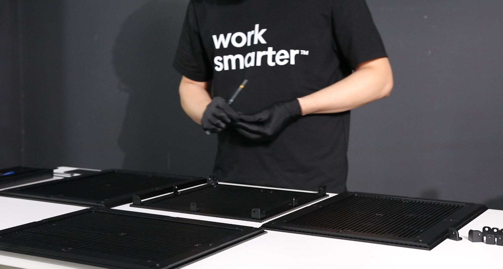
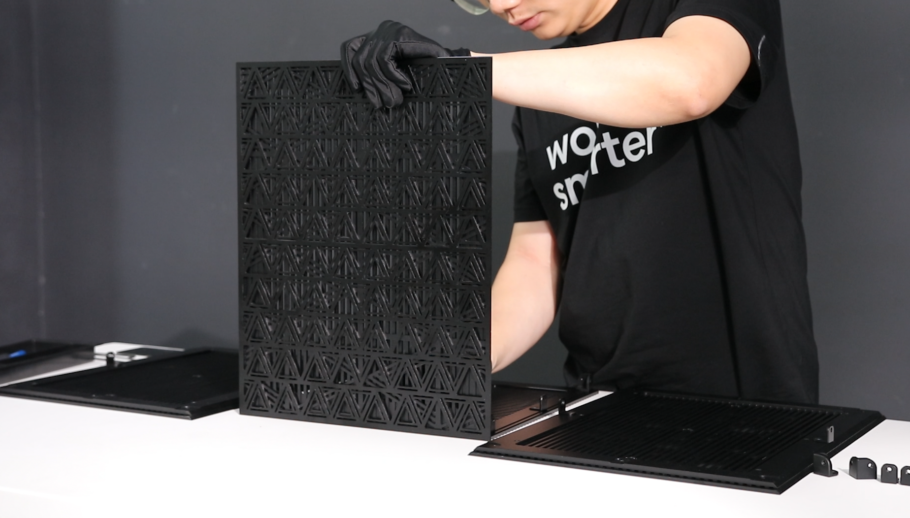
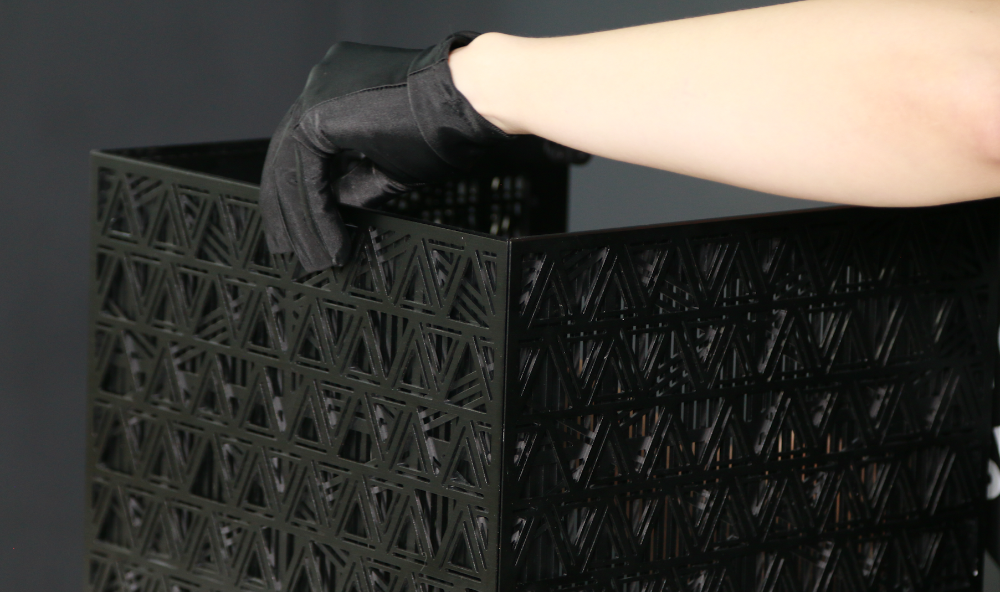
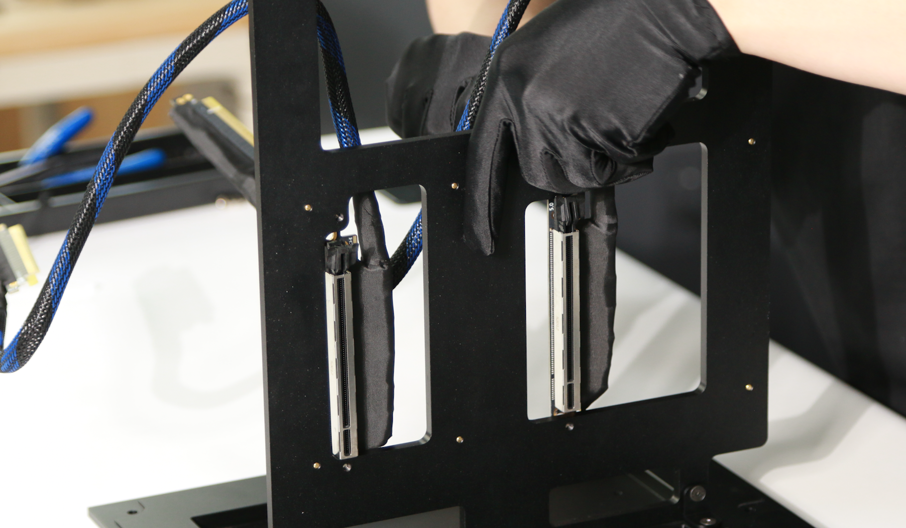
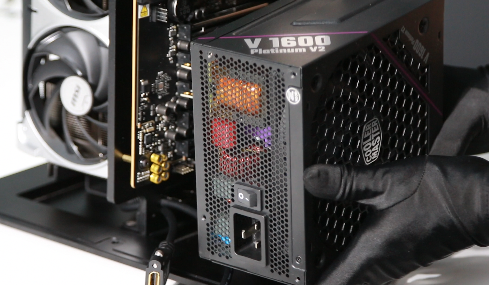
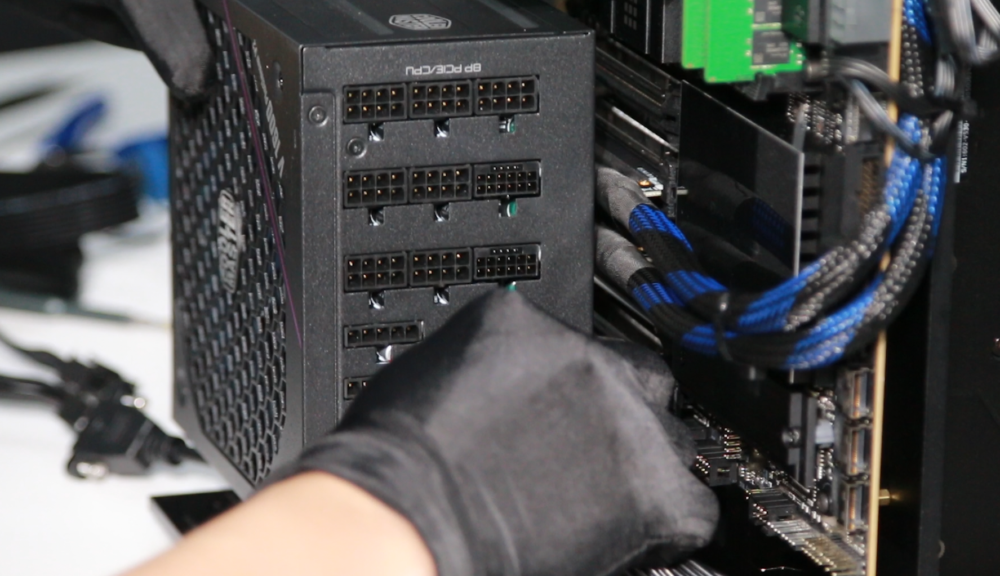
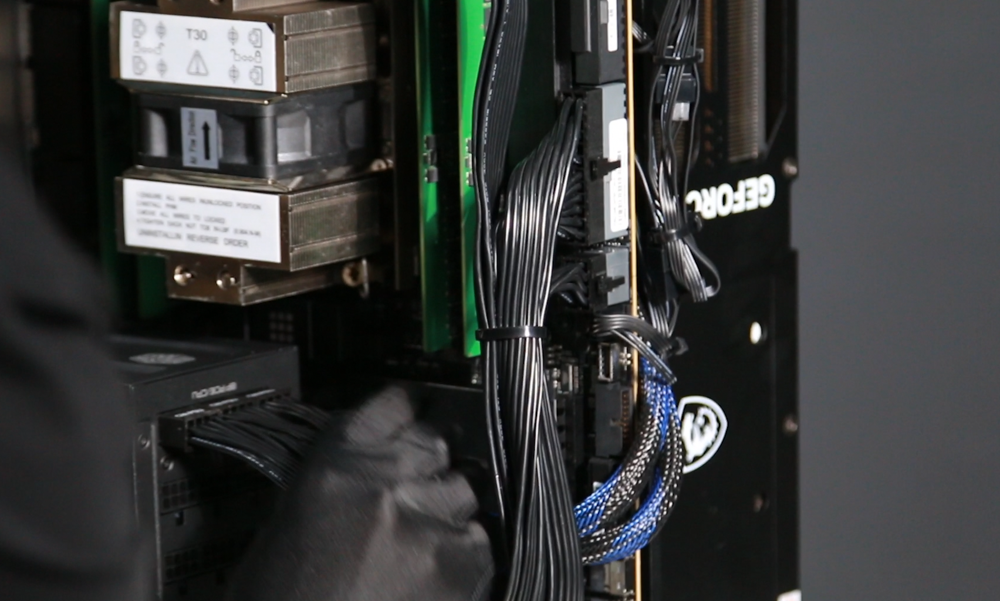
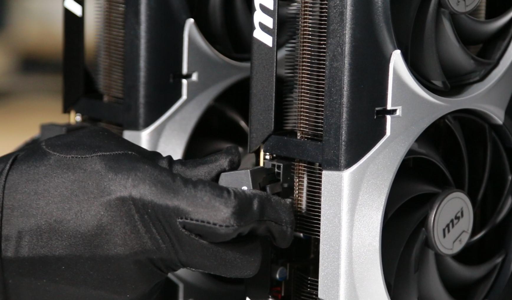
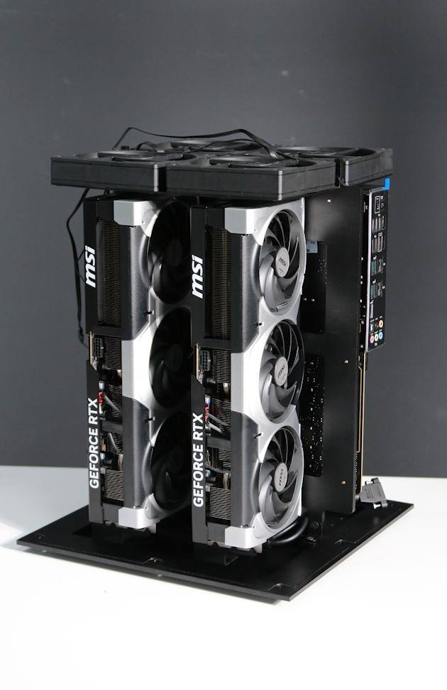

| Step | Description | Image |
|------|-------------|-------|
| 1 | Prepare housing. |  |
| 2 | Assembly side and base of housing. |  |
| 3 | Assembly other side to base of housing. |  |
| 4 | Assembly top to housing. |  |
| 5 | Attach brass hex standoff to the behind side. |  |
| 6 | Assembly PCIe riser to the mount. |  |
| 7 | Attach the fan fixed plate to the mount. |  |
| 8 | Assembly fans to the fan fixed plate. |  |
| 9 | Assembly motherboard to the mount. |  |
| 10 | Tight the motherboard to the mount. |  |
| 11 | Attach the PCIe riser to motherboard . |  |
| 12 | Attach GPUs to the female of PCIe riser. |  |
| 13 | Tight the GPUs to the mount. |  |
| 14 | Attach the PSU to the base. |  |
| 15 | Connect the cables to the PSU side. |  |
| 16 | Connect ATX cable to motherboard. |  |
| 17 | Connect 8 pin connector to motherboard. |  |
| 18 | Connect the CPU fan to motherboard. |  |
| 19 | Connect the 12 pin cable to GPUs. |  |
| 20 | Finish assembly the EE component inside. |  |
| 21 | Assembly the side of the housing . |  |
| 22 | Continue with other side. |  |
| 23 | Continue with finish side. |  |

---