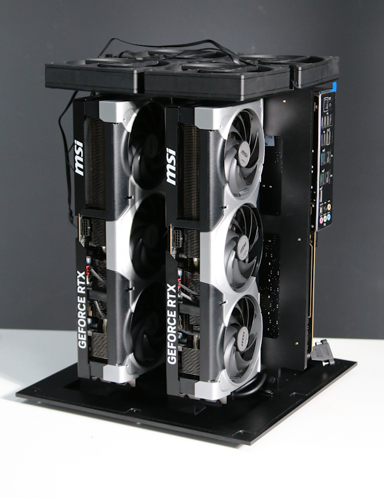
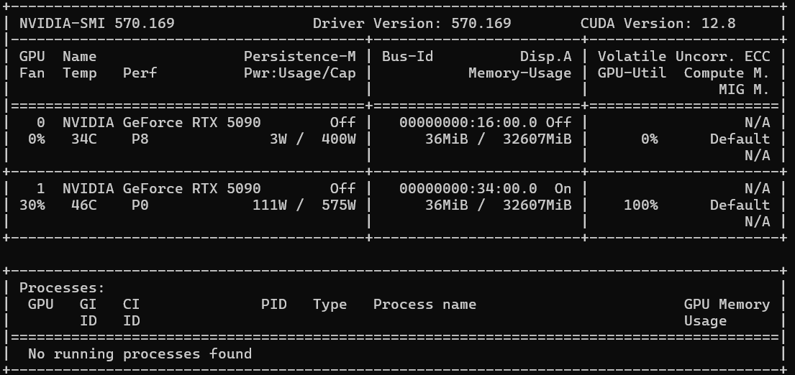

<p align="center">
    <a href="https://git.io/typing-svg">
        
    </a>
</p>

<p align="center">
    
</p>

<div align="center">


</div>

---

<div align="center">
    <b><i>
        This guide shows you how to build a cutting-edge AI server with 2x GPUs. From hardware selection to software setup, follow each step to create a high-performance platform for deep learning, data science, and GPU-intensive workloads.
    </i></b>
</div>

---

## 📚 Table of Contents
- 🏁 Introduction 
- 🛠️ Preparation 
- 🤖 Assembly 
- ⚙️ Setup
- 🧪 Testing 
- 📦 BOM
- 📝 License

---

# 🏁 Introduction &ensp; [🔝](#-table-of-contents)

<table>
    <tr>
        <td align="center" width="55%">
            <b><i>
                This tutorial guides you through building a high-performance AI server equipped with two GPUs. Whether you're a researcher, developer, or enthusiast, you'll learn everything from selecting and assembling the right hardware to configuring your system and performing initial tests. By the end, you'll have a powerful platform ready for demanding AI workloads.
            </i></b>
        </td>
        <td align="center" width="45%">
            
        </td>
    </tr>
</table>

---

# 🛠️ Preparation &ensp; [🔝](#-table-of-contents)

### 1. [**Electronic & Electrical**](https://github.com/autonomous-AI-lab/2xGPUs/blob/main/Docs/Prepare_EE.md)

### 2. [**Mechanical & Housing**](https://github.com/autonomous-AI-lab/2xGPUs/tree/main/Step_Models)

---

# 🤖 Assembly &ensp; [🔝](#-table-of-contents)
[See detailed steps](https://github.com/autonomous-AI-lab/2xGPUs/blob/main/Docs/Assembly.md)

---

# ⚙️ Setup &ensp; [🔝](#-table-of-contents)
### BIOS Optimization for GPU Performance

> **Tip:** The default BIOS settings may not deliver optimal performance for multi-GPU workloads. Adjust these parameters for best results:


- **Above 4G Decoding** <br>
    🚨📢🔔⚠️
    Enable "Above 4G Decoding" to address large GPU memory.<br>
    ```
    Advanced -> PCI Subsystems Settings -> Enable Above 4G Decoding
    ```

- **Resizable BAR** <br>
    🚨📢🔔⚠️
    Activate "Resizable BAR" for improved CPU-GPU data transfer.<br>
    ```
    Advanced -> PCI Subsystems Settings -> Enable Re-size BAR support
    ```

- **Power Management**  
    Disable unnecessary power-saving features (C-states, ASPM) that may throttle GPU performance.<br>
    `Optional`

- **Memory Configuration**  
    Set RAM to rated speed and enable XMP/DOCP profiles for max bandwidth.<br>
    `Optional`

- **Fan and Thermal Controls**  
    Adjust fan curves and thermal limits for optimal cooling.<br>
    `Optional`

After saving changes, reboot and monitor GPU performance and stability.

**References:**  
- [Motherboard User Manual 💻🖱️](https://github.com/autonomous-AI-lab/2xGPUs/blob/main/Docs/UM_Motherboard.pdf)  
- [BMC Documents 🤖](https://github.com/autonomous-AI-lab/2xGPUs/blob/main/Docs/UM_BIOS.pdf)

<p align="center">
    <video src=""></video>
</p>

---

# 🧪 Testing &ensp; [🔝](#-table-of-contents)

Boot with WinPE from USB to verify hardware, or install Linux, NVIDIA drivers, and check with `nvidia-smi or nvtop`. Once confirmed, install your OS and start your AI work.

<table>
        <td align="center">
            <br>
        </td>
</table>

<p align="center">
    <video src=""></video>
</p>

---

# 📦 Bill of Materials (BOM) &ensp; [🔝](#-table-of-contents)

- [𝄜 Bill of Materials](https://github.com/autonomous-AI-lab/2xGPUs/blob/main/BOM/BoM.md)

---

# 📝 License &ensp; [🔝](#-table-of-contents)

This project is open source under the [MIT License](https://github.com/autonomous-AI-lab/2xGPUs/blob/main/LICENSE).

---

<p align="center">
  <a href="https://git.io/typing-svg"></a>
</p>
